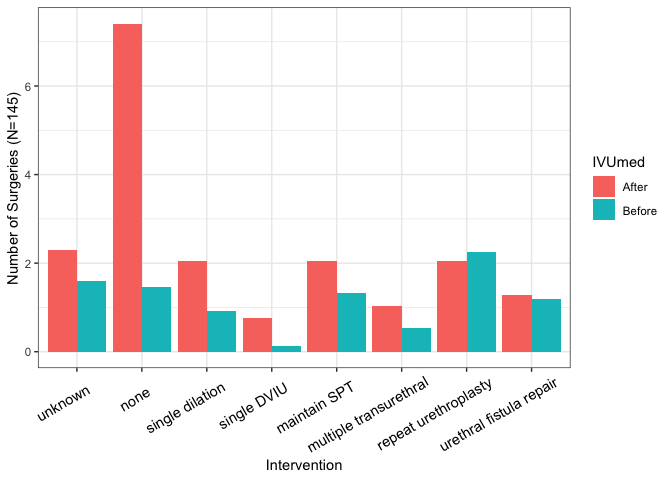
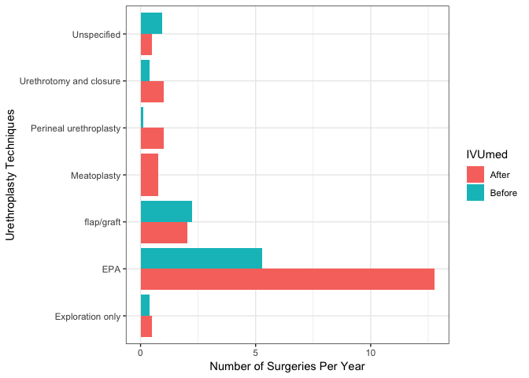

Data Analysis --- A Case Study of Urethral Stricture Management in Senegal
================
Maahum Haider, Jiaqi Yin (consultant)
May 10, 2018

Library
-------

First, we need to have some libraries whose functions are used in our analysis. If you do not have such library, just use install.packages() to install packages first.

``` r
library(readxl) # read excel file
library(dplyr)
library(pander)
library(xtable)
library(ggplot2)
library(lubridate)
library(knitr)
```

Data Exploration
================

Load data

``` r
dat_org <- read_excel("surg log by procedure data.xlsx")
```

See the dimension of the data. Check the number of patients

``` r
dim(dat_org)
```

    ## [1] 145  42

``` r
length(unique(dat_org$Patient_id))
```

    ## [1] 116

``` r
range(dat_org$`DATE of surgery`)
```

    ## [1] "2006-01-24 UTC" "2017-07-12 UTC"

There are 145 surgeries over the 11 years, and 116 patients. Change the variable type

``` r
dat1 = dat_org
# change character to factor
dat1$location_1 = as.factor(dat1$location_1)
```

Characteristics
---------------

All changes in outcomes are compared before and after 08/13/2013. We build a new variable called **b4\_1workshop** indicates whether the surgeries were done before 08/12/2013 or not (1: before/including the date, 0: after the date).

``` r
dat1$`DATE of surgery` = as.Date(dat_org$`DATE of surgery`)
b4_1workshop = rep(0, nrow(dat1))
b4_1workshop = ifelse(dat1$`DATE of surgery` <=  as.Date('8/12/13', "%m/%d/%y"), 1, 0)
dat1$b4_1workshop = b4_1workshop

# change the proprotion of before and after
before_yrs = as.numeric(as.Date('8/12/13', "%m/%d/%y") - min(dat1$`DATE of surgery`)) /365.242 

after_yrs = as.numeric(max(dat1$`DATE of surgery`) - as.Date('8/12/13', "%m/%d/%y")) / 365.242

before_yrs
```

    ## [1] 7.54842

Demogrpahics includes age, region, and documented comorbidities. We use bivariate table with respect to before/after 08/13/2013. For patients who have multiple sugeries, we use their first record. First, show the patient who has multiple surgeries during the 11 years.

``` r
mul_surgy_id = unique(dat1$Patient_id[duplicated(dat1$Patient_id)])
print(mul_surgy_id)
```

    ##  [1] "05/33110"      "06/11925"      "08/32377"      "03/12/12-0041"
    ##  [5] "26/08/09-30"   "08/16688"      "19/02/10-073"  "/08/2220"     
    ##  [9] "/08/3407"      "/05/4307"      "18/08/15-0187" "11/11/08-106" 
    ## [13] "04/15410"      "12/12655"      "25/06/13-0054" "/04/8514"     
    ## [17] "27/08/12-132"  "17/04/09-01"   "22/08/08-64"   "11/17199"     
    ## [21] "16/03/14-0018" "02/05/13-0120" "09/12/13-47"

For each patient, list the number of surgeries he/she has, and also show how many among them are before and after 8/12/13.

``` r
mul_surgy_tab = matrix(0, ncol = 4, nrow = length(mul_surgy_id))
colnames(mul_surgy_tab) = c("Patient_id", "n_surgery", "before", "after")
for(i in 1: length(mul_surgy_id)){
      id_i = mul_surgy_id[i]
      
      tmp_patient = filter(dat1, Patient_id == id_i)
      mul_surgy_tab[i,] = c(id_i, nrow(tmp_patient), sum(tmp_patient$b4_1workshop), sum(1-tmp_patient$b4_1workshop))
}
print(mul_surgy_tab)
```

    ##       Patient_id      n_surgery before after
    ##  [1,] "05/33110"      "3"       "3"    "0"  
    ##  [2,] "06/11925"      "2"       "2"    "0"  
    ##  [3,] "08/32377"      "2"       "2"    "0"  
    ##  [4,] "03/12/12-0041" "2"       "0"    "2"  
    ##  [5,] "26/08/09-30"   "3"       "2"    "1"  
    ##  [6,] "08/16688"      "3"       "3"    "0"  
    ##  [7,] "19/02/10-073"  "2"       "0"    "2"  
    ##  [8,] "/08/2220"      "3"       "3"    "0"  
    ##  [9,] "/08/3407"      "2"       "2"    "0"  
    ## [10,] "/05/4307"      "3"       "3"    "0"  
    ## [11,] "18/08/15-0187" "2"       "0"    "2"  
    ## [12,] "11/11/08-106"  "2"       "2"    "0"  
    ## [13,] "04/15410"      "2"       "2"    "0"  
    ## [14,] "12/12655"      "2"       "0"    "2"  
    ## [15,] "25/06/13-0054" "2"       "0"    "2"  
    ## [16,] "/04/8514"      "2"       "2"    "0"  
    ## [17,] "27/08/12-132"  "2"       "0"    "2"  
    ## [18,] "17/04/09-01"   "3"       "3"    "0"  
    ## [19,] "22/08/08-64"   "2"       "2"    "0"  
    ## [20,] "11/17199"      "2"       "0"    "2"  
    ## [21,] "16/03/14-0018" "2"       "0"    "2"  
    ## [22,] "02/05/13-0120" "2"       "1"    "1"  
    ## [23,] "09/12/13-47"   "2"       "0"    "2"

``` r
table(mul_surgy_tab[,2]) %>% pander
```

<table style="width:14%;">
<colgroup>
<col width="6%" />
<col width="6%" />
</colgroup>
<thead>
<tr class="header">
<th align="center">2</th>
<th align="center">3</th>
</tr>
</thead>
<tbody>
<tr class="odd">
<td align="center">17</td>
<td align="center">6</td>
</tr>
</tbody>
</table>

23 out of 116 (20%) patients have multiple surgeries. We assume each surgery is independent, even though the patient may have multiple surgeries. We remove the surgeriew whose results are unknown.

``` r
# for patients who have multiple surgeries, choose the first surgery
mul2first_surgery_mat = matrix(0, nrow = length(mul_surgy_id), ncol = ncol(dat1))
colnames(mul2first_surgery_mat) = colnames(dat1)
for(i in 1: length(mul_surgy_id)){
      id_i = mul_surgy_id[i]

      tmp_patient = filter(dat1, Patient_id == id_i)
      mul2first_surgery_mat[i,] = as.matrix(tmp_patient[which.min(tmp_patient$`DATE of surgery`),])
}

# change dat1's multiple to single surgery
## remove
dat1_unique = dat1[-which(dat1$Patient_id %in% mul_surgy_id),]
## add
dat1_unique = rbind(dat1_unique, mul2first_surgery_mat)
```

Change the age to categorical variables.

``` r
dat1_unique$AGE = as.numeric(dat1_unique$AGE)
age_cate = rep(NA, nrow(dat1_unique))
age_cate[which(dat1_unique$AGE < 20)] = "<20"
age_cate[which(dat1_unique$AGE >= 20 & dat1_unique$AGE <= 39)] = "20~39"
age_cate[which(dat1_unique$AGE >= 40 & dat1_unique$AGE <= 59)] = "40~59"
age_cate[which(dat1_unique$AGE >= 60 & dat1_unique$AGE <= 79)] = "60~79"
age_cate[which(dat1_unique$AGE >= 80)] = ">=80"

age_cate = factor(age_cate, levels = c("<20", "20~39", "40~59", "60~79", ">=80"))
dat1_unique$age_cate = age_cate

# change the region into binary category
Is_dakar = ifelse(dat1_unique$REGION == "1", "Danker", "Other")
dat1_unique$Is_dakar = Is_dakar

dat1_unique %>% count(age_cate)
```

    ## # A tibble: 5 x 2
    ##   age_cate     n
    ##   <fct>    <int>
    ## 1 <20          2
    ## 2 20~39       43
    ## 3 40~59       32
    ## 4 60~79       36
    ## 5 >=80         3

``` r
## age
age_descrip = dat1_unique %>% 
      group_by(b4_1workshop, age_cate) %>%
      summarise(n = n()) %>% mutate(prop = n / sum(n)) %>% 
      mutate(n_prop = paste(n," (",round(prop * 100, 2), "%)", sep = "")) %>%
      as.data.frame()
age_all = dat1_unique %>% count(age_cate) %>%
      mutate(prop = prop.table(n)) %>%
      mutate(n_prop = paste(n," (",round(prop * 100, 2), "%)", sep = "")) %>%
      as.data.frame()
age_descrip = cbind(as.character(age_descrip$age_cate[1:5]), age_descrip$n_prop[1:5], age_descrip$n_prop[6:10], age_all$n_prop)
pander(age_descrip)
```

<table style="width:69%;">
<colgroup>
<col width="11%" />
<col width="19%" />
<col width="19%" />
<col width="19%" />
</colgroup>
<tbody>
<tr class="odd">
<td align="center">&lt;20</td>
<td align="center">1 (1.59%)</td>
<td align="center">1 (1.89%)</td>
<td align="center">2 (1.72%)</td>
</tr>
<tr class="even">
<td align="center">20~39</td>
<td align="center">23 (36.51%)</td>
<td align="center">20 (37.74%)</td>
<td align="center">43 (37.07%)</td>
</tr>
<tr class="odd">
<td align="center">40~59</td>
<td align="center">19 (30.16%)</td>
<td align="center">13 (24.53%)</td>
<td align="center">32 (27.59%)</td>
</tr>
<tr class="even">
<td align="center">60~79</td>
<td align="center">19 (30.16%)</td>
<td align="center">17 (32.08%)</td>
<td align="center">36 (31.03%)</td>
</tr>
<tr class="odd">
<td align="center">&gt;=80</td>
<td align="center">1 (1.59%)</td>
<td align="center">2 (3.77%)</td>
<td align="center">3 (2.59%)</td>
</tr>
</tbody>
</table>

``` r
## region
region_descrip = dat1_unique %>% 
      group_by(b4_1workshop, Is_dakar) %>%
      summarise(n = n()) %>% mutate(prop = n / sum(n)) %>% 
      mutate(n_prop = paste(n," (",round(prop * 100, 2), "%)", sep = "")) %>%
      as.data.frame()
region_all = dat1_unique %>% count(Is_dakar) %>%
      mutate(prop = prop.table(n)) %>%
      mutate(n_prop = paste(n," (",round(prop * 100, 2), "%)", sep = "")) %>%
      as.data.frame()
region_descrip = cbind(region_descrip$Is_dakar[1:2], region_descrip$n_prop[1:2], region_descrip$n_prop[3:4], region_all$n_prop)
pander(region_descrip)
```

<table style="width:68%;">
<colgroup>
<col width="12%" />
<col width="19%" />
<col width="18%" />
<col width="18%" />
</colgroup>
<tbody>
<tr class="odd">
<td align="center">Danker</td>
<td align="center">44 (69.84%)</td>
<td align="center">38 (71.7%)</td>
<td align="center">82 (70.69%)</td>
</tr>
<tr class="even">
<td align="center">Other</td>
<td align="center">19 (30.16%)</td>
<td align="center">15 (28.3%)</td>
<td align="center">34 (29.31%)</td>
</tr>
</tbody>
</table>

``` r
## Comorbidities
dat1_unique$Comorbidity_1 = factor(dat1_unique$Comorbidity_1, levels = c(0:10))
comor_descrip =  dat1_unique %>% 
      group_by(b4_1workshop, Comorbidity_1) %>%
      summarise(n = n()) %>% mutate(prop = n / sum(n)) %>% 
      mutate(n_prop = paste(n," (",round(prop * 100, 2), "%)", sep = "")) %>%
      as.data.frame()
comor_all = dat1_unique %>% count(Comorbidity_1) %>%
      mutate(prop = prop.table(n)) %>%
      mutate(n_prop = paste(n," (",round(prop * 100, 2), "%)", sep = "")) %>%
      as.data.frame()

#comor_descrip = cbind(comor_descrip$Comorbidity_1[1:10], comor_descrip$n_prop[1:9], comor_descrip$n_prop[10:18], comor_all$n_prop)

pander(comor_descrip)
```

<table style="width:82%;">
<colgroup>
<col width="20%" />
<col width="22%" />
<col width="6%" />
<col width="13%" />
<col width="18%" />
</colgroup>
<thead>
<tr class="header">
<th align="center">b4_1workshop</th>
<th align="center">Comorbidity_1</th>
<th align="center">n</th>
<th align="center">prop</th>
<th align="center">n_prop</th>
</tr>
</thead>
<tbody>
<tr class="odd">
<td align="center">0</td>
<td align="center">0</td>
<td align="center">27</td>
<td align="center">0.4286</td>
<td align="center">27 (42.86%)</td>
</tr>
<tr class="even">
<td align="center">0</td>
<td align="center">1</td>
<td align="center">1</td>
<td align="center">0.01587</td>
<td align="center">1 (1.59%)</td>
</tr>
<tr class="odd">
<td align="center">0</td>
<td align="center">2</td>
<td align="center">1</td>
<td align="center">0.01587</td>
<td align="center">1 (1.59%)</td>
</tr>
<tr class="even">
<td align="center">0</td>
<td align="center">4</td>
<td align="center">5</td>
<td align="center">0.07937</td>
<td align="center">5 (7.94%)</td>
</tr>
<tr class="odd">
<td align="center">0</td>
<td align="center">5</td>
<td align="center">1</td>
<td align="center">0.01587</td>
<td align="center">1 (1.59%)</td>
</tr>
<tr class="even">
<td align="center">0</td>
<td align="center">6</td>
<td align="center">4</td>
<td align="center">0.06349</td>
<td align="center">4 (6.35%)</td>
</tr>
<tr class="odd">
<td align="center">0</td>
<td align="center">7</td>
<td align="center">15</td>
<td align="center">0.2381</td>
<td align="center">15 (23.81%)</td>
</tr>
<tr class="even">
<td align="center">0</td>
<td align="center">8</td>
<td align="center">7</td>
<td align="center">0.1111</td>
<td align="center">7 (11.11%)</td>
</tr>
<tr class="odd">
<td align="center">0</td>
<td align="center">9</td>
<td align="center">2</td>
<td align="center">0.03175</td>
<td align="center">2 (3.17%)</td>
</tr>
<tr class="even">
<td align="center">1</td>
<td align="center">0</td>
<td align="center">14</td>
<td align="center">0.2642</td>
<td align="center">14 (26.42%)</td>
</tr>
<tr class="odd">
<td align="center">1</td>
<td align="center">1</td>
<td align="center">3</td>
<td align="center">0.0566</td>
<td align="center">3 (5.66%)</td>
</tr>
<tr class="even">
<td align="center">1</td>
<td align="center">2</td>
<td align="center">2</td>
<td align="center">0.03774</td>
<td align="center">2 (3.77%)</td>
</tr>
<tr class="odd">
<td align="center">1</td>
<td align="center">4</td>
<td align="center">4</td>
<td align="center">0.07547</td>
<td align="center">4 (7.55%)</td>
</tr>
<tr class="even">
<td align="center">1</td>
<td align="center">5</td>
<td align="center">2</td>
<td align="center">0.03774</td>
<td align="center">2 (3.77%)</td>
</tr>
<tr class="odd">
<td align="center">1</td>
<td align="center">6</td>
<td align="center">4</td>
<td align="center">0.07547</td>
<td align="center">4 (7.55%)</td>
</tr>
<tr class="even">
<td align="center">1</td>
<td align="center">7</td>
<td align="center">18</td>
<td align="center">0.3396</td>
<td align="center">18 (33.96%)</td>
</tr>
<tr class="odd">
<td align="center">1</td>
<td align="center">8</td>
<td align="center">5</td>
<td align="center">0.09434</td>
<td align="center">5 (9.43%)</td>
</tr>
<tr class="even">
<td align="center">1</td>
<td align="center">10</td>
<td align="center">1</td>
<td align="center">0.01887</td>
<td align="center">1 (1.89%)</td>
</tr>
</tbody>
</table>

``` r
## combine
tab1 = rbind(as.matrix(age_descrip[,c(1,4)]), as.matrix(region_descrip[, c(1,4)]), as.matrix(comor_all[, c(1,4)]))
pander(tab1)
```

<table style="width:40%;">
<colgroup>
<col width="22%" />
<col width="18%" />
</colgroup>
<thead>
<tr class="header">
<th align="center">Comorbidity_1</th>
<th align="center">n_prop</th>
</tr>
</thead>
<tbody>
<tr class="odd">
<td align="center">&lt;20</td>
<td align="center">2 (1.72%)</td>
</tr>
<tr class="even">
<td align="center">20~39</td>
<td align="center">43 (37.07%)</td>
</tr>
<tr class="odd">
<td align="center">40~59</td>
<td align="center">32 (27.59%)</td>
</tr>
<tr class="even">
<td align="center">60~79</td>
<td align="center">36 (31.03%)</td>
</tr>
<tr class="odd">
<td align="center">&gt;=80</td>
<td align="center">3 (2.59%)</td>
</tr>
<tr class="even">
<td align="center">Danker</td>
<td align="center">82 (70.69%)</td>
</tr>
<tr class="odd">
<td align="center">Other</td>
<td align="center">34 (29.31%)</td>
</tr>
<tr class="even">
<td align="center">0</td>
<td align="center">41 (35.34%)</td>
</tr>
<tr class="odd">
<td align="center">1</td>
<td align="center">4 (3.45%)</td>
</tr>
<tr class="even">
<td align="center">2</td>
<td align="center">3 (2.59%)</td>
</tr>
<tr class="odd">
<td align="center">4</td>
<td align="center">9 (7.76%)</td>
</tr>
<tr class="even">
<td align="center">5</td>
<td align="center">3 (2.59%)</td>
</tr>
<tr class="odd">
<td align="center">6</td>
<td align="center">8 (6.9%)</td>
</tr>
<tr class="even">
<td align="center">7</td>
<td align="center">33 (28.45%)</td>
</tr>
<tr class="odd">
<td align="center">8</td>
<td align="center">12 (10.34%)</td>
</tr>
<tr class="even">
<td align="center">9</td>
<td align="center">2 (1.72%)</td>
</tr>
<tr class="odd">
<td align="center">10</td>
<td align="center">1 (0.86%)</td>
</tr>
</tbody>
</table>

### Outcome Distribution

Post-operative success was defined as a minimum of 6 months of follow-up over which there was no need for further intervention and the patient reported satisfaction with his urinary symptoms. Failure was defined as any further need for post-operative intervention within 2 years of urethroplasty or patient report of difficulty urinating.

``` r
dat1_bf = filter(dat1, b4_1workshop == "1")
dat1_af = filter(dat1, b4_1workshop == "0")

dat1_bf %>% count(`Post-op outcome`) %>% 
      mutate(prop = prop.table(n)) %>%
      mutate(n_prop = paste(n," (",round(prop * 100, 2), "%)", sep = "")) %>%
      select(`Post-op outcome`, n_prop) %>%
      pander
```

<table style="width:43%;">
<colgroup>
<col width="25%" />
<col width="18%" />
</colgroup>
<thead>
<tr class="header">
<th align="center">Post-op outcome</th>
<th align="center">n_prop</th>
</tr>
</thead>
<tbody>
<tr class="odd">
<td align="center">0</td>
<td align="center">55 (77.46%)</td>
</tr>
<tr class="even">
<td align="center">1</td>
<td align="center">8 (11.27%)</td>
</tr>
<tr class="odd">
<td align="center">2</td>
<td align="center">8 (11.27%)</td>
</tr>
</tbody>
</table>

``` r
dat1_af %>% count(`Post-op outcome`) %>%
      mutate(prop = prop.table(n)) %>%
      mutate(n_prop = paste(n," (",round(prop * 100, 2), "%)", sep = "")) %>%
      select(`Post-op outcome`, n_prop) %>%
      pander
```

<table style="width:43%;">
<colgroup>
<col width="25%" />
<col width="18%" />
</colgroup>
<thead>
<tr class="header">
<th align="center">Post-op outcome</th>
<th align="center">n_prop</th>
</tr>
</thead>
<tbody>
<tr class="odd">
<td align="center">0</td>
<td align="center">39 (52.7%)</td>
</tr>
<tr class="even">
<td align="center">1</td>
<td align="center">26 (35.14%)</td>
</tr>
<tr class="odd">
<td align="center">2</td>
<td align="center">9 (12.16%)</td>
</tr>
</tbody>
</table>

Plot the proportion of success, failure, and unknown for each year.

``` r
year_prop_out.df = dat1 %>% group_by(year = YEAR, `Post-op outcome`) %>% 
      summarise(n = n()) %>%
      mutate(prop = n / sum(n)) %>%
      as.data.frame()

year_prop_out.df$`Post-op outcome` =  as.factor(year_prop_out.df$`Post-op outcome`)

year_prop_out.df %>% 
      ggplot(aes(year, prop, group = `Post-op outcome`, color = `Post-op outcome`)) +
      geom_point(size=5) +
      geom_line(size=1.5)  +
      scale_x_continuous(breaks=c(2006:2017)) + 
      geom_vline(aes(xintercept=2013.66),size=1) + 
      scale_colour_discrete(breaks=c("0", "1", "2"),
                            labels=c("Failure", "Success", "TBD")) + 
      ylab("Proportion") + xlab("Year") + 
      theme_bw()
```



``` r
ggsave(filename = "figure/post_outcome.png", height = 5, width = 8)
```

### Urethroplasty Techniques

Plot about techniques use before/after IUVmed

``` r
as.Date("8/12/13")
```

    ## [1] "0008-12-13"

``` r
# remove one without miss 
tech = dat1$Surg_tech_1
tech[tech %in% c('2', '3', '4', '10', '11', '14', '15')] = 'flap/graft'
tech[tech == "0"] = "Exploration only"
tech[tech == "1"] = "EPA"
tech[tech == "5"] = "Fistula repair"
tech[tech == "6"] = "Meatoplasty"
tech[tech == "7"] = "Unspecified"
tech[tech == "8"] = "Urethral sling"
tech[tech == "9"] = "Perineal urethroplasty"
tech[tech == "12"] = "Duplay urethroplasty"
tech[tech == "13"] = "Urethrotomy and closure"

tech = factor(tech, levels = c("Exploration only", "EPA", 'flap/graft', "Meatoplasty", "Perineal urethroplasty", "Urethrotomy and closure", "Fistula repair", "Duplay urethroplasty", "Urethral sling", "Unspecified"))


dat1$tech = tech
tech.df = dat1 %>% group_by(b4_1workshop, tech) %>%
      count() %>% as.data.frame()
```

    ## Warning: Factor `tech` contains implicit NA, consider using
    ## `forcats::fct_explicit_na`

    ## Warning: Factor `tech` contains implicit NA, consider using
    ## `forcats::fct_explicit_na`

``` r
tech.df = tech.df[-8,]
n_per_year = rep(0, nrow(tech.df))
n_per_year[tech.df$b4_1workshop == 0] = tech.df$n[tech.df$b4_1workshop == 0] / after_yrs
n_per_year[tech.df$b4_1workshop == 1] = tech.df$n[tech.df$b4_1workshop == 1] / before_yrs
tech.df$n_per_year = n_per_year

tech.df$b4_1workshop = as.factor(tech.df$b4_1workshop)
tech.df %>% ggplot(aes(tech, n_per_year, fill = b4_1workshop)) + 
      geom_bar(stat="identity", position=position_dodge()) +
      coord_flip() +
      scale_fill_discrete(name = "IVUmed",
                          breaks=c("0", "1"),
                          labels=c("After", "Before")) + 
      ylab("Number of Surgeries Per Year") + xlab("Urethroplasty Techniques") + 
      theme_bw()
```



``` r
ggsave(filename = "figure/before_after_techs.png", height = 5, width = 8)
```

### Factors associateds with outcome

We treat multiple surgeries (for one patient) as independent.

``` r
### recode interval, 0: no prior treatment; 1: <= 6 months; 2: > 6 months
interval_trt = dat1$`Interval between treatments`
for(i in 1: nrow(dat1)){
      inter_i = dat1$`Interval between treatments`[i]
      if(inter_i == "."){
            interval_trt[i] = 0
      }else if(as.numeric(inter_i) <=6){
            interval_trt[i] = 1
      }else if(as.numeric(inter_i) > 6 & as.numeric(inter_i) < 999 ){
            interval_trt[i] = 2
      }
}
tech1 = as.character(dat1$tech)
tech1[!dat1$tech %in% c("EPA", "flap/graft")] = "other"
dat1$tech1 = as.factor(tech1)


dat1$interval_trt = as.factor(interval_trt)

dat1_wt_knownOut_ = filter(dat1, `Post-op outcome` != 2)

dat1_wt_knownOut_ %>% group_by(`Post-op outcome`, `Prior Tx`) %>%
      summarise(n=n()) %>% 
      mutate(prop = n /sum(n)) %>%
      mutate(n_prop = paste(n," (",round(prop * 100, 2), "%)", sep = "")) %>%
      select(`Prior Tx`, n_prop) %>% pander
```

    ## Adding missing grouping variables: `Post-op outcome`

<table style="width:58%;">
<colgroup>
<col width="25%" />
<col width="15%" />
<col width="18%" />
</colgroup>
<thead>
<tr class="header">
<th align="center">Post-op outcome</th>
<th align="center">Prior Tx</th>
<th align="center">n_prop</th>
</tr>
</thead>
<tbody>
<tr class="odd">
<td align="center">0</td>
<td align="center">0</td>
<td align="center">21 (22.34%)</td>
</tr>
<tr class="even">
<td align="center">0</td>
<td align="center">1</td>
<td align="center">26 (27.66%)</td>
</tr>
<tr class="odd">
<td align="center">0</td>
<td align="center">2</td>
<td align="center">47 (50%)</td>
</tr>
<tr class="even">
<td align="center">1</td>
<td align="center">.</td>
<td align="center">1 (2.94%)</td>
</tr>
<tr class="odd">
<td align="center">1</td>
<td align="center">0</td>
<td align="center">8 (23.53%)</td>
</tr>
<tr class="even">
<td align="center">1</td>
<td align="center">1</td>
<td align="center">11 (32.35%)</td>
</tr>
<tr class="odd">
<td align="center">1</td>
<td align="center">2</td>
<td align="center">14 (41.18%)</td>
</tr>
</tbody>
</table>

``` r
dat1_wt_knownOut_ %>% group_by(`Post-op outcome`, Prior_dil) %>%
      summarise(n=n()) %>% 
      mutate(prop = n /sum(n)) %>%
      mutate(n_prop = paste(n," (",round(prop * 100, 2), "%)", sep = "")) %>%
      select(Prior_dil, n_prop) %>%
      pander
```

    ## Adding missing grouping variables: `Post-op outcome`

<table style="width:60%;">
<colgroup>
<col width="25%" />
<col width="16%" />
<col width="18%" />
</colgroup>
<thead>
<tr class="header">
<th align="center">Post-op outcome</th>
<th align="center">Prior_dil</th>
<th align="center">n_prop</th>
</tr>
</thead>
<tbody>
<tr class="odd">
<td align="center">0</td>
<td align="center">.</td>
<td align="center">5 (5.32%)</td>
</tr>
<tr class="even">
<td align="center">0</td>
<td align="center">0</td>
<td align="center">54 (57.45%)</td>
</tr>
<tr class="odd">
<td align="center">0</td>
<td align="center">1</td>
<td align="center">35 (37.23%)</td>
</tr>
<tr class="even">
<td align="center">1</td>
<td align="center">.</td>
<td align="center">1 (2.94%)</td>
</tr>
<tr class="odd">
<td align="center">1</td>
<td align="center">0</td>
<td align="center">25 (73.53%)</td>
</tr>
<tr class="even">
<td align="center">1</td>
<td align="center">1</td>
<td align="center">8 (23.53%)</td>
</tr>
</tbody>
</table>

``` r
dat1_wt_knownOut_ %>% group_by(`Post-op outcome`, prior_DVIU) %>%
      summarise(n=n()) %>% 
      mutate(prop = n /sum(n)) %>%
      mutate(n_prop = paste(n," (",round(prop * 100, 2), "%)", sep = "")) %>%
      select(prior_DVIU, n_prop) %>%
      pander
```

    ## Adding missing grouping variables: `Post-op outcome`

<table style="width:61%;">
<colgroup>
<col width="25%" />
<col width="18%" />
<col width="18%" />
</colgroup>
<thead>
<tr class="header">
<th align="center">Post-op outcome</th>
<th align="center">prior_DVIU</th>
<th align="center">n_prop</th>
</tr>
</thead>
<tbody>
<tr class="odd">
<td align="center">0</td>
<td align="center">.</td>
<td align="center">5 (5.32%)</td>
</tr>
<tr class="even">
<td align="center">0</td>
<td align="center">0</td>
<td align="center">47 (50%)</td>
</tr>
<tr class="odd">
<td align="center">0</td>
<td align="center">1</td>
<td align="center">42 (44.68%)</td>
</tr>
<tr class="even">
<td align="center">1</td>
<td align="center">.</td>
<td align="center">1 (2.94%)</td>
</tr>
<tr class="odd">
<td align="center">1</td>
<td align="center">0</td>
<td align="center">16 (47.06%)</td>
</tr>
<tr class="even">
<td align="center">1</td>
<td align="center">1</td>
<td align="center">17 (50%)</td>
</tr>
</tbody>
</table>

``` r
dat1_wt_knownOut_ %>% group_by(`Post-op outcome`, interval_trt) %>%
      summarise(n=n()) %>% 
      mutate(prop = n /sum(n)) %>%
      mutate(n_prop = paste(n," (",round(prop * 100, 2), "%)", sep = "")) %>%
      select(interval_trt, n_prop) %>% pander
```

    ## Adding missing grouping variables: `Post-op outcome`

<table style="width:67%;">
<colgroup>
<col width="25%" />
<col width="20%" />
<col width="20%" />
</colgroup>
<thead>
<tr class="header">
<th align="center">Post-op outcome</th>
<th align="center">interval_trt</th>
<th align="center">n_prop</th>
</tr>
</thead>
<tbody>
<tr class="odd">
<td align="center">0</td>
<td align="center">0</td>
<td align="center">20 (21.28%)</td>
</tr>
<tr class="even">
<td align="center">0</td>
<td align="center">1</td>
<td align="center">32 (34.04%)</td>
</tr>
<tr class="odd">
<td align="center">0</td>
<td align="center">2</td>
<td align="center">31 (32.98%)</td>
</tr>
<tr class="even">
<td align="center">0</td>
<td align="center">999</td>
<td align="center">11 (11.7%)</td>
</tr>
<tr class="odd">
<td align="center">1</td>
<td align="center">0</td>
<td align="center">8 (23.53%)</td>
</tr>
<tr class="even">
<td align="center">1</td>
<td align="center">1</td>
<td align="center">7 (20.59%)</td>
</tr>
<tr class="odd">
<td align="center">1</td>
<td align="center">2</td>
<td align="center">15 (44.12%)</td>
</tr>
<tr class="even">
<td align="center">1</td>
<td align="center">999</td>
<td align="center">4 (11.76%)</td>
</tr>
</tbody>
</table>

``` r
dat1_wt_knownOut_ %>% group_by(`Post-op outcome`, `S/L_1`) %>%
      summarise(n=n()) %>% 
      mutate(prop = n /sum(n)) %>%
      mutate(n_prop = paste(n," (",round(prop * 100, 2), "%)", sep = "")) %>%
      select(`S/L_1`, n_prop) %>% pander
```

    ## Adding missing grouping variables: `Post-op outcome`

<table style="width:54%;">
<colgroup>
<col width="25%" />
<col width="11%" />
<col width="18%" />
</colgroup>
<thead>
<tr class="header">
<th align="center">Post-op outcome</th>
<th align="center">S/L_1</th>
<th align="center">n_prop</th>
</tr>
</thead>
<tbody>
<tr class="odd">
<td align="center">0</td>
<td align="center">.</td>
<td align="center">1 (1.06%)</td>
</tr>
<tr class="even">
<td align="center">0</td>
<td align="center">0</td>
<td align="center">30 (31.91%)</td>
</tr>
<tr class="odd">
<td align="center">0</td>
<td align="center">1</td>
<td align="center">29 (30.85%)</td>
</tr>
<tr class="even">
<td align="center">0</td>
<td align="center">999</td>
<td align="center">34 (36.17%)</td>
</tr>
<tr class="odd">
<td align="center">1</td>
<td align="center">0</td>
<td align="center">16 (47.06%)</td>
</tr>
<tr class="even">
<td align="center">1</td>
<td align="center">1</td>
<td align="center">12 (35.29%)</td>
</tr>
<tr class="odd">
<td align="center">1</td>
<td align="center">999</td>
<td align="center">6 (17.65%)</td>
</tr>
</tbody>
</table>

``` r
dat1_wt_knownOut_ %>% group_by(`Post-op outcome`, tech1) %>%
      summarise(n=n()) %>% 
      mutate(prop = n /sum(n)) %>%
      mutate(n_prop = paste(n," (",round(prop * 100, 2), "%)", sep = "")) %>%
      select(`tech1`, n_prop) %>% pander
```

    ## Adding missing grouping variables: `Post-op outcome`

<table style="width:61%;">
<colgroup>
<col width="25%" />
<col width="18%" />
<col width="18%" />
</colgroup>
<thead>
<tr class="header">
<th align="center">Post-op outcome</th>
<th align="center">tech1</th>
<th align="center">n_prop</th>
</tr>
</thead>
<tbody>
<tr class="odd">
<td align="center">0</td>
<td align="center">EPA</td>
<td align="center">54 (57.45%)</td>
</tr>
<tr class="even">
<td align="center">0</td>
<td align="center">flap/graft</td>
<td align="center">16 (17.02%)</td>
</tr>
<tr class="odd">
<td align="center">0</td>
<td align="center">other</td>
<td align="center">24 (25.53%)</td>
</tr>
<tr class="even">
<td align="center">1</td>
<td align="center">EPA</td>
<td align="center">25 (73.53%)</td>
</tr>
<tr class="odd">
<td align="center">1</td>
<td align="center">flap/graft</td>
<td align="center">6 (17.65%)</td>
</tr>
<tr class="even">
<td align="center">1</td>
<td align="center">other</td>
<td align="center">3 (8.82%)</td>
</tr>
</tbody>
</table>

### Intervention

``` r
intervention.df = dat1 %>% group_by(b4_1workshop, `Subs-intervention`) %>%
      count() %>% as.data.frame()
n_per_year = rep(0, nrow(intervention.df))
n_per_year[intervention.df$b4_1workshop == 0] = intervention.df$n[intervention.df$b4_1workshop == 0] / after_yrs
n_per_year[intervention.df$b4_1workshop == 1] = intervention.df$n[intervention.df$b4_1workshop == 1] / before_yrs
intervention.df$n_per_year = n_per_year


intervention.df$b4_1workshop = as.factor(intervention.df$b4_1workshop)
intervention.df$`Subs-intervention` = as.factor(intervention.df$`Subs-intervention`)
intervention.df %>% ggplot(aes(x = `Subs-intervention`, y = n_per_year, fill = b4_1workshop))+ 
      geom_bar(stat="identity", position=position_dodge()) +
      scale_fill_discrete(name = "IVUmed",
                          breaks=c("0", "1"),
                          labels=c("After", "Before")) + 
      scale_x_discrete(labels = c("unknown","none", "single dilation", "single DVIU", "maintain SPT", "multiple transurethral", "repeat urethroplasty", "urethral fistula repair")) + 
      ylab("Number of Surgeries (N=145)") + xlab("Intervention")+
      theme_bw()+
      theme(axis.text.x=element_text(color = "black", size=11, angle=30, vjust=.8, hjust=0.8))
```


``` r
ggsave(filename = "figure/before_after_intervention.png", height = 5, width = 8)
```

Questions
=========

P-value
-------

### 1. Is there a significant difference in the number of EPA urethroplasties (N=90) performed before vs after IVUmed became involved on 8/12/13?

There are 50 surgeries operated after 8/12/13, and 40 before 8/12/13. Numbers are compared in year-level

``` r
tmp1 = filter(dat1, Surg_tech_1 == 1 & b4_1workshop == 0)
tmp2 = filter(dat1, Surg_tech_1 == 1 & b4_1workshop == 1)

tmp1_Nepa = tmp1 %>% group_by(YEAR) %>% count()
tmp2_Nepa = tmp2 %>% group_by(YEAR) %>% count()

tmp1_Nepa
```

    ## # A tibble: 5 x 2
    ## # Groups:   YEAR [5]
    ##    YEAR     n
    ##   <dbl> <int>
    ## 1  2013     5
    ## 2  2014    11
    ## 3  2015    11
    ## 4  2016    11
    ## 5  2017    12

``` r
tmp2_Nepa
```

    ## # A tibble: 7 x 2
    ## # Groups:   YEAR [7]
    ##    YEAR     n
    ##   <dbl> <int>
    ## 1  2006     4
    ## 2  2007     1
    ## 3  2009    10
    ## 4  2010     7
    ## 5  2011     9
    ## 6  2012     4
    ## 7  2013     5

``` r
t.test(as.matrix(tmp1_Nepa[,2]), as.matrix(tmp2_Nepa[,2]))
```

    ## 
    ##  Welch Two Sample t-test
    ## 
    ## data:  as.matrix(tmp1_Nepa[, 2]) and as.matrix(tmp2_Nepa[, 2])
    ## t = 2.4682, df = 9.3357, p-value = 0.03478
    ## alternative hypothesis: true difference in means is not equal to 0
    ## 95 percent confidence interval:
    ##  0.379205 8.192224
    ## sample estimates:
    ## mean of x mean of y 
    ## 10.000000  5.714286

The yearly number of EPA urethroplasties performed after IVUmed is significantly larger than before IVUmed (mean 10.00/year vs. 5.71/year, P-value = 0.035)

### 2. Is there a significant difference in the number of flap/graft urethroplasties performed before vs after IVUmed became involved in 8/12/13?

``` r
list_value = c(2, 3, 4, 10, 11, 14, 15)
tmp1 = filter(dat1, Surg_tech_1 %in% list_value & b4_1workshop == 0)
tmp2 = filter(dat1, Surg_tech_1 %in% list_value & b4_1workshop == 1)

tmp1_Nfg = tmp1 %>% group_by(YEAR) %>% count()
tmp2_Nfg = tmp2 %>% group_by(YEAR) %>% count()

t.test(as.matrix(tmp1_Nfg[,2]), as.matrix(tmp2_Nfg[,2]))
```

    ## 
    ##  Welch Two Sample t-test
    ## 
    ## data:  as.matrix(tmp1_Nfg[, 2]) and as.matrix(tmp2_Nfg[, 2])
    ## t = -0.12888, df = 2.6541, p-value = 0.9066
    ## alternative hypothesis: true difference in means is not equal to 0
    ## 95 percent confidence interval:
    ##  -4.602729  4.269396
    ## sample estimates:
    ## mean of x mean of y 
    ##  2.666667  2.833333

### 3. Was there a significant difference in the success or failure rate of all urethroplasties (N=145) before vs after IVUmed became involved on 8/12/13?

``` r
# remove the surgeries' outcome is TBD
tbd_outcome = filter(dat1, `Post-op outcome` == 2)

# the number of patients who have unknown result surgery
print(paste("the number of patients whose surgeries result is unknown:", length(unique(tbd_outcome$Patient_id))))
```

    ## [1] "the number of patients whose surgeries result is unknown: 17"

``` r
# the number of unknow surgeries
print(paste("the number of surgeries with unknown results:", length(unique(tbd_outcome$Study_id))))
```

    ## [1] "the number of surgeries with unknown results: 17"

``` r
table(dat1_wt_knownOut_$`Post-op outcome`, dat1_wt_knownOut_$b4_1workshop)
```

    ##    
    ##      0  1
    ##   0 39 55
    ##   1 26  8

There are 128 sugeries left. Above is the 2 \* 2 table. Rows represent the number of failure/sucsess. Columns represent after/before 8/12/13. First we run a t-test. The null hypothesis of the t-test is the proportion of success rate before 8/12/13 is the same as it after 8/12/13. We can also do a chi-square test, and the null hypthosis is that the success rate is independent with IVUmed involved or not. Both testings have shown a significant results.

``` r
dat1_wt_knownOut_af = filter(dat1_wt_knownOut_, dat1_wt_knownOut_$b4_1workshop == 0)
dat1_wt_knownOut_bf = filter(dat1_wt_knownOut_, dat1_wt_knownOut_$b4_1workshop == 1)
# proprotion of success
t.test(dat1_wt_knownOut_af$`Post-op outcome`, dat1_wt_knownOut_bf$`Post-op outcome`)
```

    ## 
    ##  Welch Two Sample t-test
    ## 
    ## data:  dat1_wt_knownOut_af$`Post-op outcome` and dat1_wt_knownOut_bf$`Post-op outcome`
    ## t = 3.6687, df = 113.05, p-value = 0.0003734
    ## alternative hypothesis: true difference in means is not equal to 0
    ## 95 percent confidence interval:
    ##  0.1255810 0.4204508
    ## sample estimates:
    ## mean of x mean of y 
    ## 0.4000000 0.1269841

``` r
# chi-square test interpretation
chisq.test(table(dat1_wt_knownOut_$`Post-op outcome`, dat1_wt_knownOut_$b4_1workshop))
```

    ## 
    ##  Pearson's Chi-squared test with Yates' continuity correction
    ## 
    ## data:  table(dat1_wt_knownOut_$`Post-op outcome`, dat1_wt_knownOut_$b4_1workshop)
    ## X-squared = 10.865, df = 1, p-value = 0.00098

### 4. Was there a significant difference in the success or failure rate of EPA urethroplasties (N=90) before vs after IVUmed became involved in 8/12/13?

``` r
tmp = filter(dat1_wt_knownOut_, Surg_tech_1 == 1)
print(table(tmp$`Post-op outcome`, tmp$b4_1workshop))
```

    ##    
    ##      0  1
    ##   0 24 30
    ##   1 19  6

``` r
chisq.test(table(tmp$`Post-op outcome`, tmp$b4_1workshop))
```

    ## 
    ##  Pearson's Chi-squared test with Yates' continuity correction
    ## 
    ## data:  table(tmp$`Post-op outcome`, tmp$b4_1workshop)
    ## X-squared = 5.647, df = 1, p-value = 0.01748

``` r
tmp1 = filter(dat1_wt_knownOut_bf, Surg_tech_1 == 1)
tmp2 = filter(dat1_wt_knownOut_af, Surg_tech_1 == 1)
t.test(tmp1$`Post-op outcome`, tmp2$`Post-op outcome`)
```

    ## 
    ##  Welch Two Sample t-test
    ## 
    ## data:  tmp1$`Post-op outcome` and tmp2$`Post-op outcome`
    ## t = -2.7742, df = 76.192, p-value = 0.006956
    ## alternative hypothesis: true difference in means is not equal to 0
    ## 95 percent confidence interval:
    ##  -0.47275479 -0.07763281
    ## sample estimates:
    ## mean of x mean of y 
    ## 0.1666667 0.4418605

### 5.Did the number of sugeries requiring subsequent post-operative intervention change after IVUmed became involved in 8/12/13?

We treat non-zero variables as needing post-operative intervention. If we compare yearly average number of surgeries requiring post-operative intervention before vs. after, t-test will be used. If we compare the proportion of surgeries requiring post-operative intervention before vs. after, we will have a new binary variable to indicate whether there is post intervention or not.

It is better to see distribution of sugeries on post-operative intervention after/before 8/12/13 first.

``` r
print(table(dat1$`Subs-intervention`, dat1$b4_1workshop))
```

    ##    
    ##      0  1
    ##   .  9 12
    ##   0 29 11
    ##   1  8  7
    ##   2  3  1
    ##   3  8 10
    ##   4  4  4
    ##   5  8 17
    ##   7  5  9

There are 21 surgeries with missing. We remove such surgeries. First to test the average number of post-intervention surgeries

``` r
dat1_no_miss_intervt = filter(dat1, `Subs-intervention` != '.')

tmp1 = filter(dat1_no_miss_intervt, `Subs-intervention` != "0" & b4_1workshop == 0)
tmp2 = filter(dat1_no_miss_intervt, `Subs-intervention` != "0" & b4_1workshop == 1)

tmp1_Nitvn = tmp1 %>% group_by(YEAR) %>% count()
tmp2_Nitvn = tmp2 %>% group_by(YEAR) %>% count()

t.test(as.matrix(tmp1_Nitvn)[,2], as.matrix(tmp2_Nitvn)[,2])
```

    ## 
    ##  Welch Two Sample t-test
    ## 
    ## data:  as.matrix(tmp1_Nitvn)[, 2] and as.matrix(tmp2_Nitvn)[, 2]
    ## t = 0.53152, df = 9.7284, p-value = 0.607
    ## alternative hypothesis: true difference in means is not equal to 0
    ## 95 percent confidence interval:
    ##  -3.849541  6.249541
    ## sample estimates:
    ## mean of x mean of y 
    ##       7.2       6.0

Next to see the proportion of surgeries requiring subsequent post-operative intervention change after IVUmed became involved in 8/12/13.

``` r
# add a binary variable "No_intervention" to indicate whether there is intervention (1) or not (0)
dat1_no_miss_intervt$intervention = ifelse(dat1_no_miss_intervt$`Subs-intervention` != "0", 1, 0)
dat1_no_miss_intervt$no_intervention = 1 - dat1_no_miss_intervt$intervention

dat1_no_miss_intervt_af = filter(dat1_no_miss_intervt, b4_1workshop == 0)
dat1_no_miss_intervt_bf = filter(dat1_no_miss_intervt, b4_1workshop == 1)

# compare no intervetion after/before 
print(t.test(dat1_no_miss_intervt_af$intervention, dat1_no_miss_intervt_bf$intervention))
```

    ## 
    ##  Welch Two Sample t-test
    ## 
    ## data:  dat1_no_miss_intervt_af$intervention and dat1_no_miss_intervt_bf$intervention
    ## t = -3.2273, df = 119.54, p-value = 0.001613
    ## alternative hypothesis: true difference in means is not equal to 0
    ## 95 percent confidence interval:
    ##  -0.4190531 -0.1003733
    ## sample estimates:
    ## mean of x mean of y 
    ## 0.5538462 0.8135593

### 6. Did the number of surgeries which were 'subsequent-intervention-free' change after IVUmed became involved in 8/12/13?

``` r
# yearly operations number
tot_tmp1 = dat1_no_miss_intervt_af %>% group_by(YEAR) %>% count()
tot_tmp2 = dat1_no_miss_intervt_bf %>% group_by(YEAR) %>% count()

# no intervention
tmp1 = filter(dat1_no_miss_intervt_af, `Subs-intervention` == "0")
tmp2 = filter(dat1_no_miss_intervt_bf, `Subs-intervention` == "0")

tmp1_Nitvn = tmp1 %>% group_by(YEAR) %>% count()
tmp2_Nitvn = tmp2 %>% group_by(YEAR) %>% count()

# some year the intervention number is zero
tmp1_Nitvn_vec = rep(0, nrow(tot_tmp1))
tmp1_Nitvn_vec[as.matrix(tot_tmp1[,1]) %in% as.matrix(tmp1_Nitvn[,1])] = as.matrix(tmp1_Nitvn[,2])

tmp2_Nitvn_vec = rep(0, nrow(tot_tmp2))
tmp2_Nitvn_vec[as.matrix(tot_tmp2[,1]) %in% as.matrix(tmp2_Nitvn[,1])] = as.matrix(tmp2_Nitvn[,2])

t.test(tmp1_Nitvn_vec, tmp2_Nitvn_vec)
```

    ## 
    ##  Welch Two Sample t-test
    ## 
    ## data:  tmp1_Nitvn_vec and tmp2_Nitvn_vec
    ## t = 2.003, df = 4.2387, p-value = 0.1117
    ## alternative hypothesis: true difference in means is not equal to 0
    ## 95 percent confidence interval:
    ##  -1.57489 10.42489
    ## sample estimates:
    ## mean of x mean of y 
    ##     5.800     1.375

``` r
# test the proportion
# compare no intervetion after/before 
print(t.test(dat1_no_miss_intervt_af$no_intervention, dat1_no_miss_intervt_bf$no_intervention))
```

    ## 
    ##  Welch Two Sample t-test
    ## 
    ## data:  dat1_no_miss_intervt_af$no_intervention and dat1_no_miss_intervt_bf$no_intervention
    ## t = 3.2273, df = 119.54, p-value = 0.001613
    ## alternative hypothesis: true difference in means is not equal to 0
    ## 95 percent confidence interval:
    ##  0.1003733 0.4190531
    ## sample estimates:
    ## mean of x mean of y 
    ## 0.4461538 0.1864407

### 7. Are surgery techniques independent with IVUmend involved?

We run a chi-square test between surgery techinique and whether them performed with members of IVUmed team. First to show the distributions of sugery techinques.

``` r
table(dat1$Surg_tech_1, dat1$IVUmed)
```

    ##     
    ##       0  1
    ##   .   1  0
    ##   0   3  2
    ##   1  84  6
    ##   10  1  0
    ##   13  7  0
    ##   14  1  0
    ##   15  3  0
    ##   2  12  0
    ##   3   2  0
    ##   4   1  5
    ##   6   3  0
    ##   7   8  1
    ##   9   3  2

There is one surgery with unknown sugery techinque, and we remove it.

``` r
dat1_wt_knownSurg = filter(dat1, Surg_tech_1 != ".")
chisq.test(table(dat1_wt_knownSurg$Surg_tech_1, dat1_wt_knownSurg$IVUmed))
```

    ## Warning in chisq.test(table(dat1_wt_knownSurg$Surg_tech_1,
    ## dat1_wt_knownSurg$IVUmed)): Chi-squared approximation may be incorrect

    ## 
    ##  Pearson's Chi-squared test
    ## 
    ## data:  table(dat1_wt_knownSurg$Surg_tech_1, dat1_wt_knownSurg$IVUmed)
    ## X-squared = 45.562, df = 11, p-value = 3.863e-06

We fail to accept the null hypothesis that surgery techniques are independent with whether IVUmed team involved.

### 8. The question "What are the odds of wound breakdown and/or surgical site infection after a flap/graft urethroplasty" is rephrased as "whether the wound breakdown and/or surgical site infection is independent with flap/graft urethroplasty"

First, we show a 2\*2 table with columns as whether flap/graft urethroplasty and rows as whether wound breakdown and/or surgical site infection. Note that ID "29/02/16-031" has missing for Wound breakdown/fistula.

``` r
# the dataset we use here includes the patients who may have multiple surgeries
# add a binary variable Is_wb_ssi, 1: wound breakdown and/or surgical site infection; 0: no
#
dat1$Is_wb_ssi = ifelse(dat1$SSI==1 | dat1$`Wound breakdown/fistula`==1, 1, 0)

# get the data with flap/graft procedures
list_value = c(2, 3, 4, 10, 11, 14, 15)
# add a new variable indicating whehther it is  flap/graft urethroplasty (1) or other surgeries (0)
dat1$Is_flapGraft = ifelse(dat1$Surg_tech_1 %in% list_value, 1, 0)
table(dat1$Is_wb_ssi, dat1$Is_flapGraft)
```

    ##    
    ##       0   1
    ##   0 110  13
    ##   1   9  12

``` r
# test
chisq.test(table(dat1$Is_wb_ssi, dat1$Is_flapGraft))
```

    ## Warning in chisq.test(table(dat1$Is_wb_ssi, dat1$Is_flapGraft)): Chi-
    ## squared approximation may be incorrect

    ## 
    ##  Pearson's Chi-squared test with Yates' continuity correction
    ## 
    ## data:  table(dat1$Is_wb_ssi, dat1$Is_flapGraft)
    ## X-squared = 23.97, df = 1, p-value = 9.783e-07

If we want to compare the odds of wound breakdown and/or surgical site infection after a flap/graft urethroplasty vs. after other urethreplasty technieques, we can have a logistic regression

``` r
# show the table, rows: wound breakdown and/or surgical site infection; cols: flap/graft urethroplasty
logic_reg = glm(Is_wb_ssi ~ Is_flapGraft, family = binomial(link='logit'), data = dat1 )
summary(logic_reg)
```

    ## 
    ## Call:
    ## glm(formula = Is_wb_ssi ~ Is_flapGraft, family = binomial(link = "logit"), 
    ##     data = dat1)
    ## 
    ## Deviance Residuals: 
    ##     Min       1Q   Median       3Q      Max  
    ## -1.1436  -0.3966  -0.3966  -0.3966   2.2724  
    ## 
    ## Coefficients:
    ##              Estimate Std. Error z value Pr(>|z|)    
    ## (Intercept)   -2.5033     0.3467  -7.220 5.19e-13 ***
    ## Is_flapGraft   2.4232     0.5296   4.576 4.75e-06 ***
    ## ---
    ## Signif. codes:  0 '***' 0.001 '**' 0.01 '*' 0.05 '.' 0.1 ' ' 1
    ## 
    ## (Dispersion parameter for binomial family taken to be 1)
    ## 
    ##     Null deviance: 119.639  on 143  degrees of freedom
    ## Residual deviance:  98.393  on 142  degrees of freedom
    ##   (1 observation deleted due to missingness)
    ## AIC: 102.39
    ## 
    ## Number of Fisher Scoring iterations: 5

The coefficent of the logistic regression is 2.4323 (p-value: 4.36e-06). We further have that if the patient had undergone a flap/graft procedure, in which case their odds of wound breakdown or SSI were 10.39 times (=exp(2.4323)-1) larger than other urethroplasty techniques.

Multivariate Analysis
---------------------

Logistic regression with post-operation failure as outcome. Predict of interests are: 1. before/after 8/12/13 2. 3.

Before we start to run the multivariate analysis, check the missing of surgeries.

``` r
# missing
## outcome
outcome_miss = filter(dat1, `Post-op outcome` == 2)$Study_id
print(outcome_miss)
```

    ##  [1] "111" "79"  "67"  "80"  "11"  "72"  "4"   "22"  "42"  "86"  "53" 
    ## [12] "27b" "87"  "26"  "107" "55b" "18"

``` r
## ivumed no missing
## prior procedures, Prior Tx
prior_tx_miss = filter(dat1, `Prior Tx` == '.')$Study_id
print(prior_tx_miss)
```

    ## [1] "66"

``` r
## prior urethral dilation
prior_dil_miss = filter(dat1, Prior_dil == '.')$Study_id
print(prior_dil_miss)
```

    ## [1] "60"  "16a" "59"  "5"   "66"  "3"

``` r
## prior DVIU
prior_DVIU_miss = filter(dat1, prior_DVIU == '.')$Study_id
print(prior_DVIU_miss)
```

    ## [1] "60"  "16a" "59"  "5"   "66"  "3"

``` r
## Time interval between procedures 
interval_miss = filter(dat1, `Interval between treatments`=="999")$Study_id
print(interval_miss)
```

    ##  [1] "54"  "60"  "82"  "16a" "102" "6a"  "59"  "55a" "1"   "34"  "120"
    ## [12] "17a" "71"  "83"  "87"  "107" "3"

``` r
## Location of stricture 
loc_miss = filter(dat1, location_1 == ".")$Study_id
print(loc_miss)
```

    ## [1] "17b"

``` r
### recode, 0: proximal; 1: bulbar; 2: other
loc_str = as.character(dat1$location_1)
loc_str[loc_str %in% c("1", "2", "3")] = 0
loc_str[loc_str %in% "4"] = 1
loc_str[loc_str %in% c("5", "6", "7", "8", "9")] = 2
dat1$loc_str = loc_str
## Length of stricture, SL
leng_miss = filter(dat1, `S/L_1`=="999")$Study_id
print(leng_miss)
```

    ##  [1] "10"   "14"   "15"   "35"   "62"   "125"  "56"   "118"  "21"   "7"   
    ## [11] "78"   "11"   "72"   "4"    "22"   "46"   "24a"  "5"    "8"    "19"  
    ## [21] "85"   "116"  "13b"  "24b"  "43a"  "52b"  "127"  "44b"  "1"    "34"  
    ## [31] "36b"  "43b"  "36a"  "23c"  "37"   "38a"  "38b"  "30"   "32"   "83"  
    ## [41] "47"   "112a" "26"   "107"  "55b"  "92b"  "3"

``` r
## Urethroplasty technique, no missing
## recode, 1: EPA; 2: flap or graft; 3: other
tech = as.character(dat1$Surg_tech_1)
tech[tech %in% c("2", "3", "4", "10", "11", "14", "15")] = 2
tech[tech %in% c("0", as.character(5:9), "12","13")] = 3
dat1$tech = as.factor(tech)
```

List the missing of variables we might need in the multivariate regression.

``` r
miss_tab = c(length(outcome_miss), 0, length(prior_tx_miss), length(prior_dil_miss), length(prior_DVIU_miss), length(interval_miss), length(loc_miss), length(leng_miss), 0)
names(miss_tab) = c("failure", "IVU_med_team", "prior_tx", "prior_dil", "prior_dviu", "interval", "loc", "length", "tech")
print(miss_tab)
```

    ##      failure IVU_med_team     prior_tx    prior_dil   prior_dviu 
    ##           17            0            1            6            6 
    ##     interval          loc       length         tech 
    ##           17            1           47            0

The overall patients who has missing

``` r
miss_surg = unique(c(outcome_miss, prior_tx_miss, prior_dil_miss, prior_DVIU_miss, interval_miss, loc_miss, leng_miss))
length(miss_surg)
```

    ## [1] 70

There are 70 surgeries (48.3%) have missing. Since there are 47 missing in length of stricture. Due to the larger number of missing, we will not add the variable into out final regresson.

``` r
miss_surg = unique(c(outcome_miss, prior_tx_miss, prior_dil_miss, prior_DVIU_miss, interval_miss, loc_miss))
print(miss_surg)
```

    ##  [1] "111" "79"  "67"  "80"  "11"  "72"  "4"   "22"  "42"  "86"  "53" 
    ## [12] "27b" "87"  "26"  "107" "55b" "18"  "66"  "60"  "16a" "59"  "5"  
    ## [23] "3"   "54"  "82"  "102" "6a"  "55a" "1"   "34"  "120" "17a" "71" 
    ## [34] "83"  "17b"

``` r
length(miss_surg)
```

    ## [1] 35

Finally, there are 35 (24.\`%) patients who have miss. We rule out these 35 surgeries, and do the multivariate regression on 110 surgeries left.

``` r
# remove patients who have missing among the variables
dat_wo_miss = dat1[!dat1$Study_id %in% miss_surg,]
```

We run a logsitic regression. First to see raw regression, and then adding variables to adjust the regressoin.

``` r
dat_wo_miss$Is_after = 1 - dat_wo_miss$b4_1workshop
dat_wo_miss$Is_failure = 1 - dat_wo_miss$`Post-op outcome`
# raw 
logit_raw = glm(Is_failure ~ Is_after, family = binomial('logit'), data = dat_wo_miss)

round(summary(logit_raw)$coef[2,c(1,2,4)],3)  %>% pander()
```

<table style="width:47%;">
<colgroup>
<col width="15%" />
<col width="18%" />
<col width="13%" />
</colgroup>
<thead>
<tr class="header">
<th align="center">Estimate</th>
<th align="center">Std. Error</th>
<th align="center">Pr(&gt;|z|)</th>
</tr>
</thead>
<tbody>
<tr class="odd">
<td align="center">-1.567</td>
<td align="center">0.51</td>
<td align="center">0.002</td>
</tr>
</tbody>
</table>

``` r
# raw + IVUmed team
logit_1 = glm(Is_failure ~ Is_after + IVUmed, family = binomial('logit'), data = dat_wo_miss)
summary(logit_1)
```

    ## 
    ## Call:
    ## glm(formula = Is_failure ~ Is_after + IVUmed, family = binomial("logit"), 
    ##     data = dat_wo_miss)
    ## 
    ## Deviance Residuals: 
    ##     Min       1Q   Median       3Q      Max  
    ## -2.0688  -0.9854   0.5003   0.8884   1.3824  
    ## 
    ## Coefficients:
    ##             Estimate Std. Error z value Pr(>|z|)    
    ## (Intercept)   2.0149     0.4346   4.636 3.55e-06 ***
    ## Is_after     -1.2890     0.5365  -2.403   0.0163 *  
    ## IVUmed       -1.1959     0.6511  -1.837   0.0662 .  
    ## ---
    ## Signif. codes:  0 '***' 0.001 '**' 0.01 '*' 0.05 '.' 0.1 ' ' 1
    ## 
    ## (Dispersion parameter for binomial family taken to be 1)
    ## 
    ##     Null deviance: 126.90  on 109  degrees of freedom
    ## Residual deviance: 112.36  on 107  degrees of freedom
    ## AIC: 118.36
    ## 
    ## Number of Fisher Scoring iterations: 4

``` r
# raw + tech
logit_2 = glm(Is_failure ~ Is_after + tech1, family = binomial('logit'), data = dat_wo_miss)
summary(logit_2)
```

    ## 
    ## Call:
    ## glm(formula = Is_failure ~ Is_after + tech1, family = binomial("logit"), 
    ##     data = dat_wo_miss)
    ## 
    ## Deviance Residuals: 
    ##     Min       1Q   Median       3Q      Max  
    ## -2.0051  -1.2040   0.5363   0.6206   1.1511  
    ## 
    ## Coefficients:
    ##                 Estimate Std. Error z value Pr(>|z|)    
    ## (Intercept)       1.8665     0.4743   3.935 8.32e-05 ***
    ## Is_after         -1.7020     0.5269  -3.230  0.00124 ** 
    ## tech1flap/graft  -0.1023     0.6378  -0.160  0.87260    
    ## tech1other        1.3850     0.6925   2.000  0.04550 *  
    ## ---
    ## Signif. codes:  0 '***' 0.001 '**' 0.01 '*' 0.05 '.' 0.1 ' ' 1
    ## 
    ## (Dispersion parameter for binomial family taken to be 1)
    ## 
    ##     Null deviance: 126.90  on 109  degrees of freedom
    ## Residual deviance: 110.63  on 106  degrees of freedom
    ## AIC: 118.63
    ## 
    ## Number of Fisher Scoring iterations: 4

``` r
# raw + prior
logit_3 =  glm(Is_failure ~ Is_after + as.factor(`Prior Tx`) + as.factor(Prior_dil) + as.factor(prior_DVIU), family = binomial('logit'), data = dat_wo_miss)
summary(logit_3)
```

    ## 
    ## Call:
    ## glm(formula = Is_failure ~ Is_after + as.factor(`Prior Tx`) + 
    ##     as.factor(Prior_dil) + as.factor(prior_DVIU), family = binomial("logit"), 
    ##     data = dat_wo_miss)
    ## 
    ## Deviance Residuals: 
    ##     Min       1Q   Median       3Q      Max  
    ## -2.5065  -0.9681   0.4894   0.7414   1.4023  
    ## 
    ## Coefficients:
    ##                        Estimate Std. Error z value Pr(>|z|)    
    ## (Intercept)             2.07035    0.60261   3.436 0.000591 ***
    ## Is_after               -1.62943    0.53764  -3.031 0.002440 ** 
    ## as.factor(`Prior Tx`)1  0.71015    0.80679   0.880 0.378743    
    ## as.factor(`Prior Tx`)2  0.08003    0.91009   0.088 0.929925    
    ## as.factor(Prior_dil)1   0.94677    0.73102   1.295 0.195271    
    ## as.factor(prior_DVIU)1 -1.03555    0.67077  -1.544 0.122631    
    ## ---
    ## Signif. codes:  0 '***' 0.001 '**' 0.01 '*' 0.05 '.' 0.1 ' ' 1
    ## 
    ## (Dispersion parameter for binomial family taken to be 1)
    ## 
    ##     Null deviance: 126.90  on 109  degrees of freedom
    ## Residual deviance: 110.11  on 104  degrees of freedom
    ## AIC: 122.11
    ## 
    ## Number of Fisher Scoring iterations: 4

``` r
# full
logit_full = glm(Is_failure ~ Is_after + IVUmed + as.factor(`Prior Tx`) + as.factor(Prior_dil) + as.factor(prior_DVIU) + interval_trt + loc_str + tech1, family = binomial('logit'), data = dat_wo_miss)
summary(logit_full)
```

    ## 
    ## Call:
    ## glm(formula = Is_failure ~ Is_after + IVUmed + as.factor(`Prior Tx`) + 
    ##     as.factor(Prior_dil) + as.factor(prior_DVIU) + interval_trt + 
    ##     loc_str + tech1, family = binomial("logit"), data = dat_wo_miss)
    ## 
    ## Deviance Residuals: 
    ##     Min       1Q   Median       3Q      Max  
    ## -2.5014  -0.4480   0.4178   0.6254   1.7884  
    ## 
    ## Coefficients:
    ##                         Estimate Std. Error z value Pr(>|z|)   
    ## (Intercept)               2.9423     1.0404   2.828  0.00468 **
    ## Is_after                 -1.2251     0.5899  -2.077  0.03781 * 
    ## IVUmed                   -2.0376     0.9173  -2.221  0.02633 * 
    ## as.factor(`Prior Tx`)1  -12.9407  1455.3980  -0.009  0.99291   
    ## as.factor(`Prior Tx`)2  -13.1700  1455.3980  -0.009  0.99278   
    ## as.factor(Prior_dil)1     0.4315     0.7933   0.544  0.58649   
    ## as.factor(prior_DVIU)1   -1.2578     0.8507  -1.479  0.13924   
    ## interval_trt1            14.0317  1455.3977   0.010  0.99231   
    ## interval_trt2            13.5250  1455.3978   0.009  0.99259   
    ## loc_str1                 -1.4079     0.8859  -1.589  0.11200   
    ## loc_str2                 -1.1137     1.0919  -1.020  0.30771   
    ## tech1flap/graft           0.4686     0.7995   0.586  0.55779   
    ## tech1other                1.5635     0.8560   1.826  0.06778 . 
    ## ---
    ## Signif. codes:  0 '***' 0.001 '**' 0.01 '*' 0.05 '.' 0.1 ' ' 1
    ## 
    ## (Dispersion parameter for binomial family taken to be 1)
    ## 
    ##     Null deviance: 126.902  on 109  degrees of freedom
    ## Residual deviance:  96.276  on  97  degrees of freedom
    ## AIC: 122.28
    ## 
    ## Number of Fisher Scoring iterations: 14

``` r
tab = rbind(raw = summary(logit_raw)$coef[2,c(1,2,4)], 
            'model 1' = summary(logit_1)$coef[2,c(1,2,4)], 
            'model 2' = summary(logit_2)$coef[2,c(1,2,4)], 
            'model 3' = summary(logit_3)$coef[2,c(1,2,4)],
            full = summary(logit_full)$coef[2,c(1,2,4)]) 
tab %>%
      pander
```

<table style="width:67%;">
<colgroup>
<col width="19%" />
<col width="15%" />
<col width="18%" />
<col width="13%" />
</colgroup>
<thead>
<tr class="header">
<th align="center"> </th>
<th align="center">Estimate</th>
<th align="center">Std. Error</th>
<th align="center">Pr(&gt;|z|)</th>
</tr>
</thead>
<tbody>
<tr class="odd">
<td align="center"><strong>raw</strong></td>
<td align="center">-1.567</td>
<td align="center">0.51</td>
<td align="center">0.002126</td>
</tr>
<tr class="even">
<td align="center"><strong>model 1</strong></td>
<td align="center">-1.289</td>
<td align="center">0.5365</td>
<td align="center">0.01628</td>
</tr>
<tr class="odd">
<td align="center"><strong>model 2</strong></td>
<td align="center">-1.702</td>
<td align="center">0.5269</td>
<td align="center">0.001238</td>
</tr>
<tr class="even">
<td align="center"><strong>model 3</strong></td>
<td align="center">-1.629</td>
<td align="center">0.5376</td>
<td align="center">0.00244</td>
</tr>
<tr class="odd">
<td align="center"><strong>full</strong></td>
<td align="center">-1.225</td>
<td align="center">0.5899</td>
<td align="center">0.03781</td>
</tr>
</tbody>
</table>
